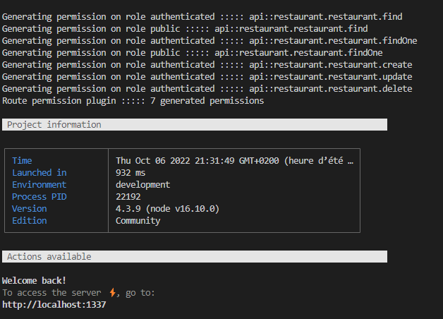

# Strapi4 plugin server route permission
Inspired from [strapi-plugin-route-permission](https://github.com/andreciornavei/strapi-plugin-route-permission), same plugin but for strapi V3.

A plugin for [Strapi](https://github.com/strapi/strapi) that provides the ability to config roles on server route for generate permissions.

[](https://www.npmjs.com/package/strapi-plugin-server-route-permission)
[](https://github.com/PaulRichez/strapi4-plugin-route-permission/blob/main/Licence)

## 🚀 &nbsp; _Overview_

This plugin implements a simple way to seed strapi users-permissions from routes configuration (only server). It means that you can define your routes permissions direcly on route files. So every time your server ups, it will recreate yours routes permissions from your route config, allowing you to migrate your application without worrying about redefine your routes permissions over strapi panel.

⚠️ **this plugin create route permission but don't delete any route permission**

---

## ⏳ &nbsp; _Installation_

With npm:
```bash
npm install strapi4-plugin-route-permission
```

With yarn:
```bash
yarn add strapi4-plugin-route-permission
```

---

## ✨ &nbsp; _Getting Started_

Add an array of roles on each route configuration

### Examples:

Core route example :
```js
'use strict';

/**
 * restaurant router.
 */

const { createCoreRouter } = require('@strapi/strapi').factories;

module.exports = createCoreRouter('api::restaurant.restaurant', {
    config: {
        find: {
            roles: ["authenticated"],
        }
    }
});
```

custom route :

```js
// server/routes/task.js
'use strict';

/**
 *  router.
 */

module.exports = {
  type: "content-api",
  routes: [
    {
      method: 'POST',
      path: '/user/update-avatar',
      handler: 'user.updateAvatar',
      config: {
        roles: ["authenticated"],
        policies: [],
        middlewares: [],
      },
    },
    {
      method: 'DELETE',
      path: '/user/delete-avatar',
      handler: 'user.deleteAvatar',
      config: {
        roles: ["authenticated"],
      },
    },
    {
      method: 'GET',
      path: '/avatar/:id',
      handler: 'avatar.getAvatar',
      config: {
        roles: ["authenticated"],
      },
    },
  ],
};
```

## 🎉 &nbsp; _Result_

On strapi startup it add every permission configured in your route config (no remove)




## 🐛 &nbsp; _Bugs_

If any bugs are found please report them as a [Github Issue](https://github.com/PaulRichez/strapi4-plugin-route-permission/issues)
